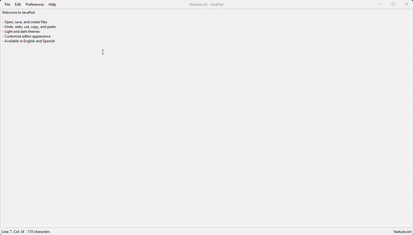

# JavaPad

[](https://openjdk.org/)
[](https://maven.apache.org/)
[](https://junit.org/junit5/)

JavaPad is a simple and user-friendly text editor written in Java. It includes essential features such as file operations, undo/redo actions, theme customization, and multilingual support.



## Features

- **Open, Save, and Create Files:** Easily manage your text files.
- **Undo, Redo, Cut, Copy, Paste:** Full support for text editing operations.
- **Light and Dark Themes:** Choose between light, dark, and native themes to suit your preferences.
- **Editor Customization:** Personalize the appearance and behavior of the editor.
- **Multilingual Support:** Available in English, Spanish and French.

## Installation and use

1. Clone the repository
    ```bash
    git clone https://github.com/dfortch18/javapad.git
    ```
2. Navigate to the directory
    ```bash
   cd javapad
   ```
3. Build the project using Maven
    ```bash
   mvn clean install
   ```

## Usage

To run JavaPad, use the following command after building the project:
```bash
java -jar target/javapad-1.1.jar
```

## Development

### Prerequisites

- Java 21 or higher
- Maven 3.6 or higher

### Building the project

To build the project, run:
```bash
mvn clean install
```

### Running Tests

To execute tests, run:

```bash
mvn test
```

### Code coverage

Code coverage reports can be generated using Jacoco. To generate the report, run:

```bash
mvn test jacoco:report
```

The report will be available at target/site/jacoco/index.html.

## Contributing

Contributions are welcome! Please fork the repository and create a pull request with your changes. Ensure that you adhere to the project's coding standards and include appropriate tests for your contributions.

1. Fork the repository.
2. Create a feature branch (`git checkout -b feature/your-feature`).
3. Commit your changes (`git commit -m 'Add some feature'`).
4. Push to the branch (`git push origin feature/your-feature`).
5. Create a new Pull Request.

## License

This project is licensed under the MIT License. See the [LICENSE](./LICENSE) file for more details.

## Acknowledgements

- [FlatLaf](https://github.com/JFormDesigner/FlatLaf) for the sleek look and feel.
- [Log4j](https://logging.apache.org/log4j/2.x/) for logging.
- [AssertJ](https://github.com/assertj/assertj) for fluent assertions in testing.
- [JUnit 5](https://junit.org/junit5/) for the testing framework.
- [Mockito](https://site.mockito.org/) for mocking in tests.
- [Weld SE](https://weld.cdi-spec.org/) for the CDI implementation.
